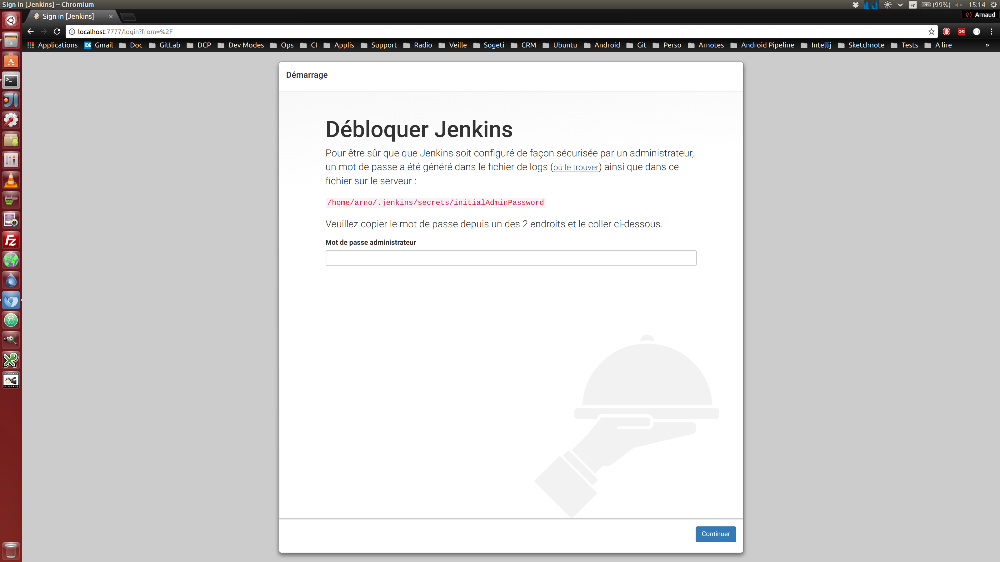
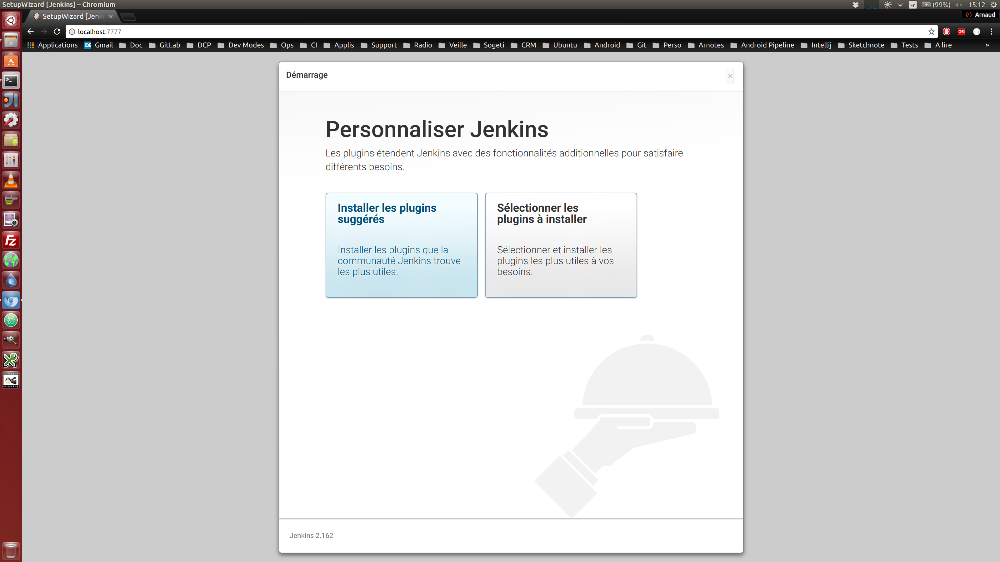

# Préparation de l'environnement IGCI

## Pré-requis

### Mise à jour des dépôts
`sudo apt-get update`

### Java 8 minimum
`sudo apt-get install java-1.8.0-openjdk`

`java -version`

### Docker
`sudo apt-get install docker`

`docker -v`

`sudo service docker start`

`docker run hello-world`

### Git
`sudo apt-get install git`

`git --version`

### Jenkins

Télécharger jenkins.war (https://jenkins.io/download/) dans /usr/share/jenkins

`java -jar /usr/share/jenkins/jenkins.war --httpPort=7777`

--> go to http://localhost:7777

_Débloquer_

_Installation des plugins_

En plus des recommandations :
  - Enlever Ant, Gradle et Subversion
  - Ajouter HTML Publisher et JUnit

### Projet exemple

`git clone https://github.com/spring-projects/spring-petclinic.git`

`cd spring-petclinic`

`./mvnw install`
